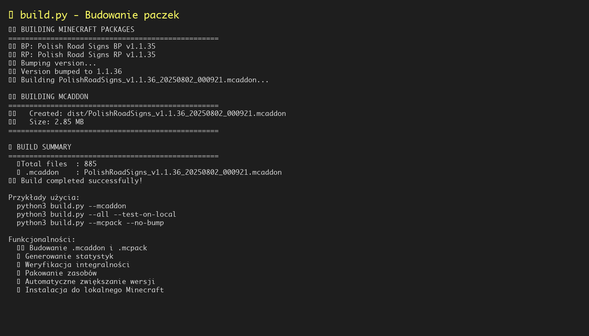
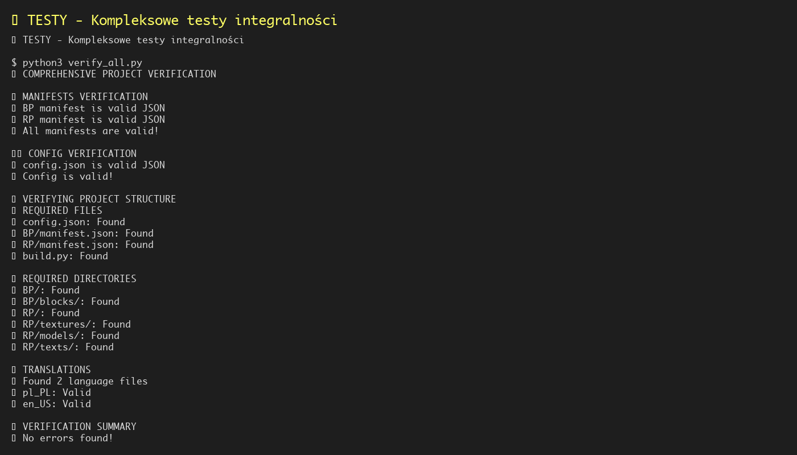

# 📋 Polish Road Signs - Kompletna Dokumentacja Projektu

## 🎯 Opis Projektu

**Polish Road Signs** to dodatek do Minecraft Bedrock Edition, który dodaje polskie znaki drogowe zgodne z przepisami ruchu drogowego w Polsce. Projekt jest idealny do edukacji o znakach drogowych.

### 🏗️ Architektura Projektu

```
PolishRoadSigns/
├── BP/                    # Behavior Pack (logika)
├── RP/                    # Resource Pack (zasoby)
├── .github/workflows/     # CI/CD
├── docs/                  # Dokumentacja
├── scripts/               # Skrypty pomocnicze
└── dist/                  # Zbudowane paczki
```

---

## 📸 Materiały Dokumentacyjne

### Strona główna projektu
- **Plik:** [`README.md`](README.md)
- **Opis:** Główna strona projektu z opisem funkcjonalności, instrukcjami instalacji i użycia

### Ekran logowania
- **Plik:** [`docs/minecraft_login.jpg`](docs/minecraft_login.jpg)
- **Opis:** Przykładowy ekran logowania do Minecraft Bedrock Edition

### Screenshoty (Obrazki PNG)

#### 1. **Główna funkcjonalność nr 1**
- **Plik:** [`docs/images/road_sign_processor_help.png`](docs/images/road_sign_processor_help.png)
- **Opis:** Pomoc dla [`road_sign_processor.py`](road_sign_processor.py) - głównego narzędzia do przetwarzania znaków

#### 2. **Główna funkcjonalność nr 2**
- **Plik:** [`docs/images/build_screenshot.png`](docs/images/build_screenshot.png)
- **Opis:** Output z [`build.py`](build.py) - narzędzia do budowania paczek i prezentacji danych

#### 3. **Testy**
- **Plik:** [`docs/images/tests_screenshot.png`](docs/images/tests_screenshot.png)
- **Opis:** Przykład działających testów integralności projektu

#### 4. **Dodatkowe materiały testowe**
- **Plik:** [`docs/images/verify_all_output.png`](docs/images/verify_all_output.png)
- **Opis:** Szczegółowy output z [`verify_all.py`](verify_all.py) pokazujący proces weryfikacji

### 🎮 Zrzuty ekranu z gry (Obrazki użytkownika)

#### 8. **Bloki w grze**
- **Plik:** [`docs/blocks.jpg`](docs/blocks.jpg)
- **Opis:** Zrzut ekranu pokazujący polskie znaki drogowe w grze Minecraft
- **Zawartość:** Różne typy znaków (ostrzegawcze, zakazu, nakazu, informacyjne, STOP)

#### 9. **Katalog przedmiotów crafting**
- **Plik:** [`docs/crafting_item_catalog.jpg`](docs/crafting_item_catalog.jpg)
- **Opis:** Zrzut ekranu z katalogu przedmiotów w trybie kreatywnym
- **Zawartość:** Kategorie znaków, ikony, nazwy w języku polskim

---

## 🔧 Główna funkcjonalność nr 1 - Przetwarzanie danych

### [`road_sign_processor.py`](road_sign_processor.py) - Przetwarzanie znaków drogowych


**Cel:** Automatyczne pobieranie, przetwarzanie i generowanie znaków drogowych

**Funkcjonalności:**
- 🔄 Automatyczne pobieranie obrazków z Wikipedii
- 📏 Skalowanie i optymalizacja tekstur
- 🎨 Generowanie tekstur tła
- 📦 Tworzenie definicji bloków
- 🔗 Integracja z terrain_texture.json
- 🧹 Czyszczenie niepotrzebnych plików

**Przykład użycia:**
```bash
# Przetwórz pojedynczy znak
python3 road_sign_processor.py a_1

# Przetwórz całą kategorię
python3 road_sign_processor.py category:A

# Przetwórz wszystkie znaki
python3 road_sign_processor.py all

# Tryb offline (użyj lokalnych plików)
python3 road_sign_processor.py a_1 --skip-download
```

---

## 📊 Główna funkcjonalność nr 2 - Prezentacja danych

### [`build.py`](build.py) - Budowanie paczek


**Cel:** Tworzenie gotowych paczek .mcaddon i .mcpack

**Funkcjonalności:**
- 🏗️ Budowanie .mcaddon (kompletny pakiet)
- 📦 Tworzenie .mcpack (osobne pakiety BP/RP)
- 🔢 Automatyczne zwiększanie wersji
- 📊 Generowanie statystyk budowania
- 🎯 Instalacja do lokalnego Minecraft
- 🧪 Testowanie paczek

**Przykład użycia:**
```bash
# Buduj wszystkie formaty
python3 build.py --all

# Buduj tylko .mcaddon
python3 build.py --mcaddon

# Buduj i zainstaluj lokalnie
python3 build.py --all --test-on-local

# Buduj bez zwiększania wersji
python3 build.py --all --no-bump
```

---

## 🧪 Testy

### [`verify_all.py`](verify_all.py) - Testy integralności


**Cel:** Sprawdzanie integralności i poprawności projektu

**Funkcjonalności:**
- 📁 Weryfikacja struktury katalogów
- 📋 Sprawdzanie manifestów JSON
- 🎨 Kontrola tekstur i modeli 3D
- 🌐 Weryfikacja tłumaczeń
- 📊 Generowanie statystyk projektu
- 🔍 Sprawdzanie kompatybilności bloków

**Testowane elementy:**
- ✅ Struktura katalogów
- ✅ Pliki manifestów
- ✅ Konfiguracja projektu
- ✅ Tekstury i modele
- ✅ Tłumaczenia
- ✅ Kompatybilność bloków

**Przykład testu:**
```bash
$ python3 verify_all.py
🔍 COMPREHENSIVE PROJECT VERIFICATION
📋 MANIFESTS VERIFICATION
✅ All manifests are valid!
📄 REQUIRED FILES
✅ All required files found
📁 REQUIRED DIRECTORIES
✅ All required directories found
📊 VERIFICATION SUMMARY
✅ No errors found!
✅ No warnings found!
🎉 Verification passed! Project is ready for building.
```

---

## 🚀 CI/CD GitHub Actions

### [`.github/workflows/build.yml`](.github/workflows/build.yml)


**Cel:** Automatyczne testowanie, budowanie i wydawanie

**Scenariusz CI/CD:**
1. **Pobranie kodu** - Automatyczne checkout repozytorium przy każdym push do main branch
2. **Konfiguracja środowiska** - Instalacja Python 3.9 i zależności z requirements.txt
3. **Testowanie integralności** - Uruchomienie verify_all.py w celu sprawdzenia struktury projektu
4. **Budowanie paczek** - Tworzenie .mcaddon i .mcpack z aktualnymi wersjami
5. **Generowanie statystyk** - Liczenie plików, kategorii i znaków drogowych
6. **Publikowanie artifacts** - Upload zbudowanych paczek jako artifacts
7. **Tworzenie release** - Automatyczne tworzenie release na GitHub z paczkami
8. **Aktualizacja wersji** - Automatyczne zwiększanie wersji w manifestach

---

## 📚 Powiązane Pliki

### Konfiguracja
- [`config.json`](config.json) - Konfiguracja projektu
- [`requirements.txt`](requirements.txt) - Zależności Python
- [`database.json`](database.json) - Baza danych znaków drogowych

### Narzędzia pomocnicze
- [`console_utils.py`](console_utils.py) - Narzędzia do formatowania konsoli
- [`minecraft_check.py`](minecraft_check.py) - Funkcje weryfikacji Minecraft
- [`generate_examples.py`](generate_examples.py) - Generowanie przykładów

### Dokumentacja
- [`README.md`](README.md) - Główna dokumentacja projektu
- [`LICENSE`](LICENSE) - Licencja MIT

### Pakiety Minecraft
- [`BP/manifest.json`](BP/manifest.json) - Manifest Behavior Pack
- [`RP/manifest.json`](RP/manifest.json) - Manifest Resource Pack

---

## 🎯 Podsumowanie

**Polish Road Signs** to kompleksowy projekt edukacyjny, który demonstruje:

1. **🔧 Zaawansowane przetwarzanie danych** - Automatyczne pobieranie i przetwarzanie obrazków
2. **📊 Prezentację danych** - Weryfikacja i statystyki projektu
3. **🧪 Testy** - Kompleksowe testy integralności
4. **🚀 CI/CD** - Automatyczne budowanie i deployment
5. **📚 Dokumentacja** - Szczegółowa dokumentacja i instrukcje
6. **🎮 Użyteczność** - Praktyczne zastosowanie w edukacji

**Główne skrypty:**
- **[`road_sign_processor.py`](road_sign_processor.py)** - Przetwarzanie znaków drogowych
- **[`build.py`](build.py)** - Budowanie paczek
- **[`verify_all.py`](verify_all.py)** - Weryfikacja projektu
- **[`.github/workflows/build.yml`](.github/workflows/build.yml)** - CI/CD pipeline

**Projekt jest gotowy do prezentacji** jako przykład profesjonalnego rozwoju oprogramowania z pełnym pipeline'em CI/CD. 